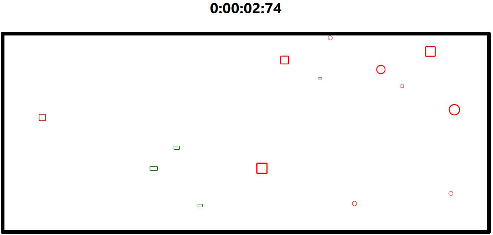

	<h1 style="text-align: center;">Mouse Race Game</h1>
    
	 
	<a href="https://mouse-race.netlify.app">See the game in action!</a>

<h2>Description</h2>

Mouse Race Game is a simple web-based game where players need to click on elements appearing on the screen to collect them. The game involves different types of elements with specific behaviors, such as Collect, Avoid, and Change. The goal of the game is to collect all the Collect and Change elements while avoiding the Avoid elements to win.

<h2>Instructions</h2>
<ol>
    <li>Click the 'Start' button in the center of the screen to begin the game.</li>
    <li>Elements will appear randomly on the screen.</li>
    <li>Click on the Collect elements (green) to collect them.</li>
    <li>Avoid clicking on the Avoid elements (red) to prevent losing.</li>
    <li>The Change elements (square) alternate their behavior between Collect and Avoid.</li>
    <li>Make all the Collect and Change elements disappear to win the game.</li>
    <li>After finishing the game, submit your time to the leaderboard.</li>
</ol>

<h2>Features</h2>
<ul>
    <li>Object-Oriented Architecture: Implemented using JavaScript classes to represent game elements.</li>
    <li>Random Element Generation: Elements appear randomly on the screen with various behaviors.</li>
    <li>Dynamic Element Movement: Elements move and change direction/color according to their behavior.</li>
    <li>Stopwatch: A timer tracks the elapsed time during gameplay.</li>
	<li>Local Storage: Utilized for saving player's time and displaying it on the leaderboard.</li>
</ul>
</ul>

<h2>Dependencies</h2>
<ul>
    <li>React: JavaScript library for building user interfaces.</li>
    <li>Bootstrap: Front-end framework for designing responsive websites.</li>
    <li>react-bootstrap: Bootstrap components built with React.</li>
    <li>react-icons: Library for adding icons to React applications.</li>
</ul>

<h2>Algorithms</h2>
<ul>
    <li>Random Number Generation: Used to determine the number of elements and their positions.</li>
    <li>Interval-based Movement: Elements move at regular intervals based on their behavior.</li>
</ul>
